# Distributed CQRS Architecture

Visual reference for **CqrsDemo.Distributed.sln** — domain microservices, event sourcing, transactional outbox, Azure Service Bus, and checkout saga orchestration.

> **Runbook:** [README-DISTRIBUTED.md](./README-DISTRIBUTED.md) · **Code flows:** [CODE-FLOWS.md](./CODE-FLOWS.md) · **DB schemas:** [DATABASE-SCHEMA.md](./DATABASE-SCHEMA.md)

---

## 1. System overview

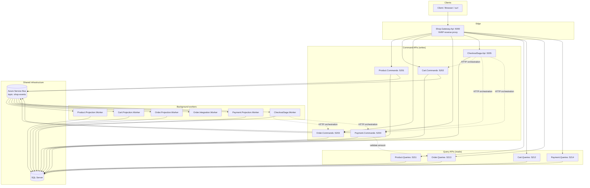

---

## 2. CQRS pattern (per domain service)

Each bounded context splits **writes** and **reads** into separate deployables and databases.

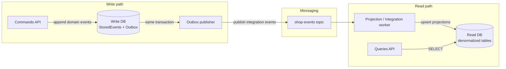

| Layer | Responsibility |
|-------|----------------|
| **Commands API** | Accept HTTP → MediatR command → load/append aggregate → save to event store |
| **Write DB** | Append-only `StoredEvents` + `OutboxMessages` (transactional outbox) |
| **Outbox publisher** | Poll outbox → publish to Service Bus (at-least-once) |
| **Worker** | Consume subscription → update read model (or cross-service integration) |
| **Queries API** | Read-only HTTP over projected tables |

---

## 3. Database topology

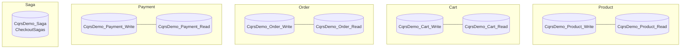

**Rule:** no shared write database between domains. Cross-domain consistency uses **integration events** and the **checkout saga**, not distributed transactions.

---

## 4. API gateway routing

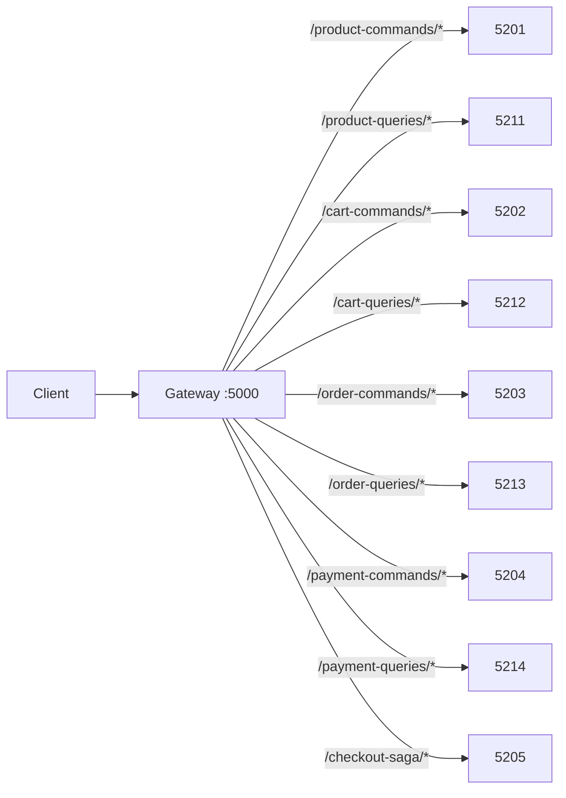

Example: `GET http://localhost:5000/product-queries/api/products` → `http://localhost:5211/api/products`.

---

## 5. Event bus topology

Single topic **`shop-events`** with competing subscriptions (pub/sub fan-out).

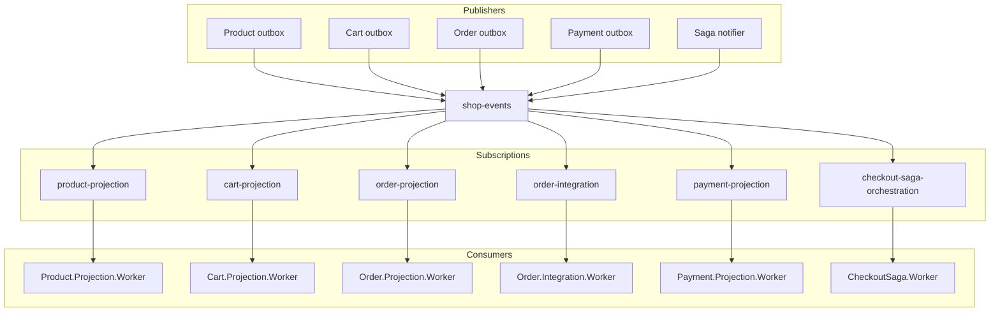

### Integration event catalog

| Event type | Typical publisher | Main consumers |
|------------|-------------------|----------------|
| `product.created.v1` | Product | product-projection |
| `product.price-updated.v1` | Product | product-projection |
| `cart.created.v1` | Cart | cart-projection |
| `cart.item-added.v1` | Cart | cart-projection |
| `cart.item-removed.v1` | Cart | cart-projection |
| `cart.checked-out.v1` | Cart | cart-projection, **order-integration** |
| `order.created.v1` | Order | order-projection, **checkout-saga-orchestration** |
| `order.paid.v1` | Order | order-projection |
| `order.cancelled.v1` | Order | order-projection |
| `payment.initiated.v1` | Payment | payment-projection |
| `payment.completed.v1` | Payment | payment-projection, **checkout-saga-orchestration** |
| `payment.failed.v1` | Payment | payment-projection, **checkout-saga-orchestration** |
| `checkout-saga.completed.v1` | Saga | (observers / future) |
| `checkout-saga.failed.v1` | Saga | (observers / future) |

---

## 6. Checkout saga — orchestration flow

The saga is the **single entry point** for distributed checkout. It uses **HTTP commands** for steps and **async events** to know when downstream work finished.

### 6.1 Happy path (sequence)

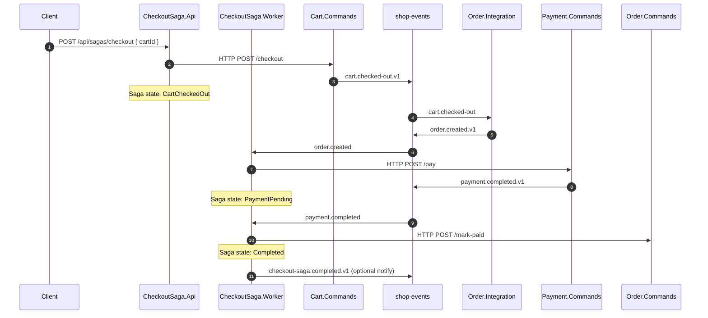

### 6.2 Compensation path (payment failure)

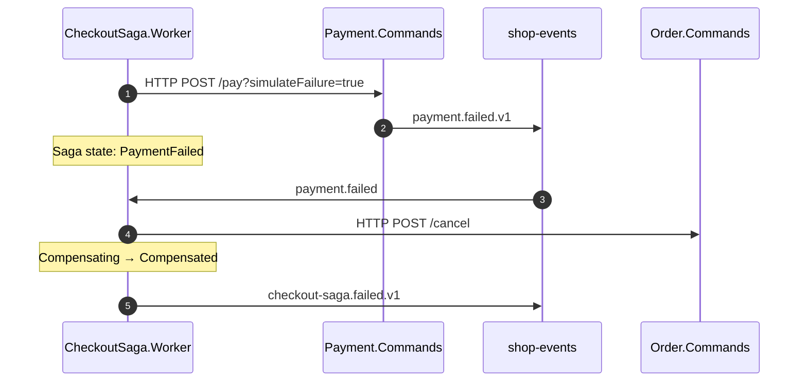

### 6.3 Saga state machine

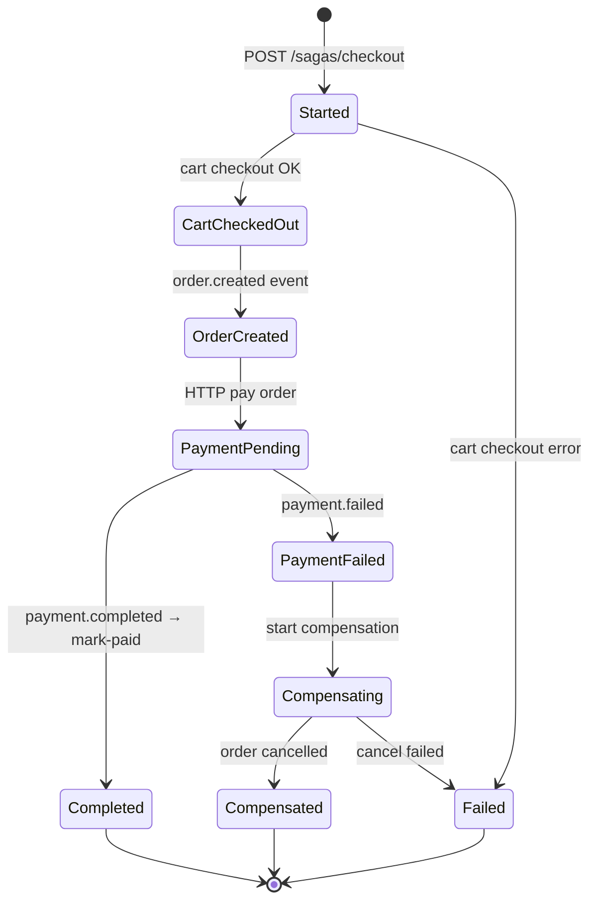

---

## 7. Service map (deployables)

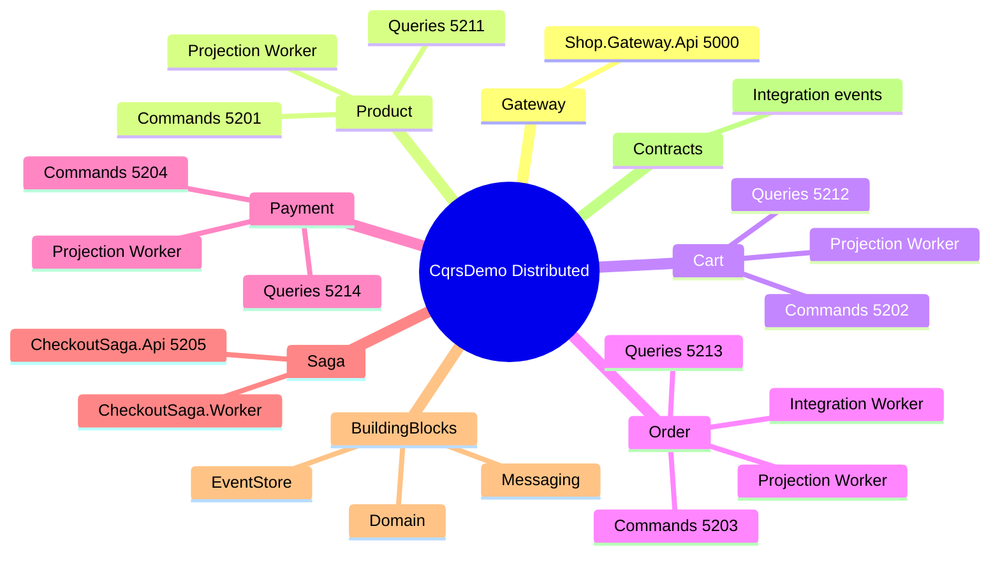

| # | Process | Port | Role |
|---|---------|------|------|
| 1 | Shop.Gateway.Api | 5000 | Edge routing |
| 2 | Product.Commands.Api | 5201 | Write products |
| 3 | Product.Queries.Api | 5211 | Read products |
| 4 | Cart.Commands.Api | 5202 | Write carts |
| 5 | Cart.Queries.Api | 5212 | Read carts |
| 6 | Order.Commands.Api | 5203 | Mark paid / cancel (saga) |
| 7 | Order.Queries.Api | 5213 | Read orders |
| 8 | Payment.Commands.Api | 5204 | Process payments |
| 9 | Payment.Queries.Api | 5214 | Read payments |
| 10 | CheckoutSaga.Api | 5205 | Start & query sagas |
| 11–16 | 6 workers | — | Projections, integration, saga |

---

## 8. Solution structure (code)

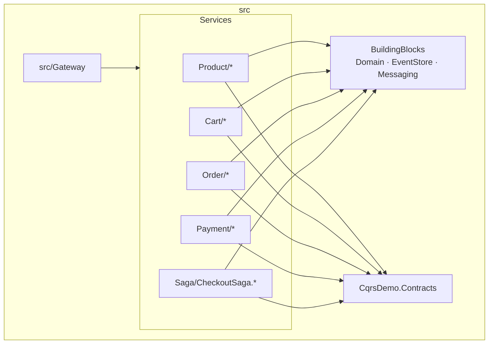

---

## 9. Design decisions (quick reference)

| Decision | Choice | Why |
|----------|--------|-----|
| CQRS | Separate command/query APIs + DBs | Scale reads/writes independently; simple query models |
| Writes | Event sourcing (`StoredEvents`) | Audit trail; rebuild aggregates from history |
| Cross-service messaging | Transactional outbox + Service Bus | Reliable publish after DB commit |
| Checkout consistency | **Saga orchestration** | Explicit steps, compensation, visible state |
| Order creation | `Order.Integration` reacts to `cart.checked-out` | Keeps cart service unaware of order schema |
| Payment validation | HTTP to Order.Queries | Sync read of projected total before charge |

---

## 10. Local infrastructure

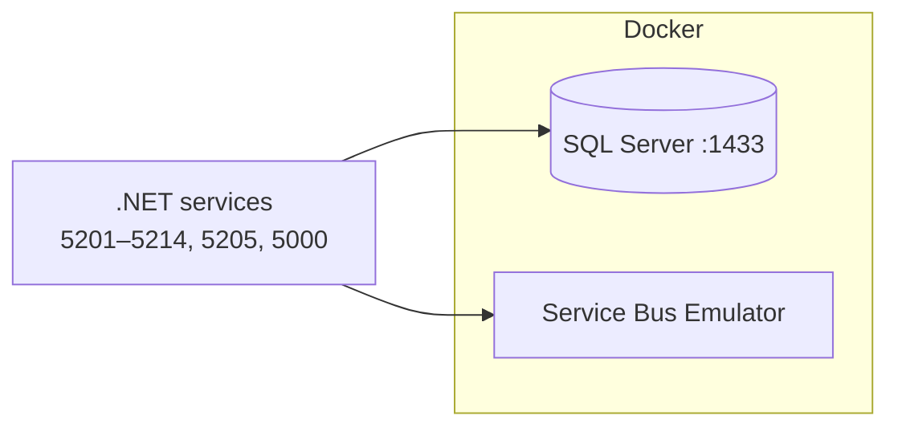

Config: `docker/docker-compose.yml` (SQL Server + Kafka).

---

*Generated for the distributed microservices demo. Diagrams use [Mermaid](https://mermaid.js.org/) — render in GitHub, VS Code, or Cursor markdown preview.*
