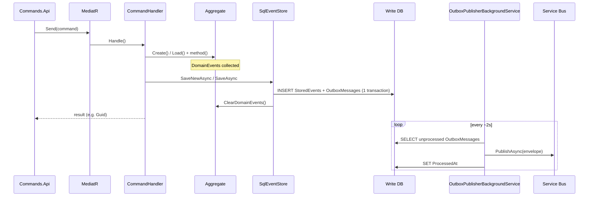
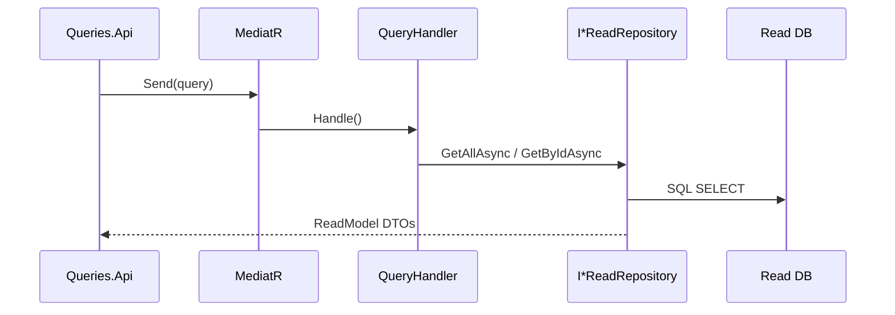
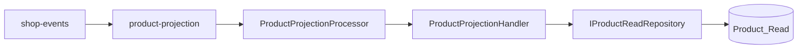
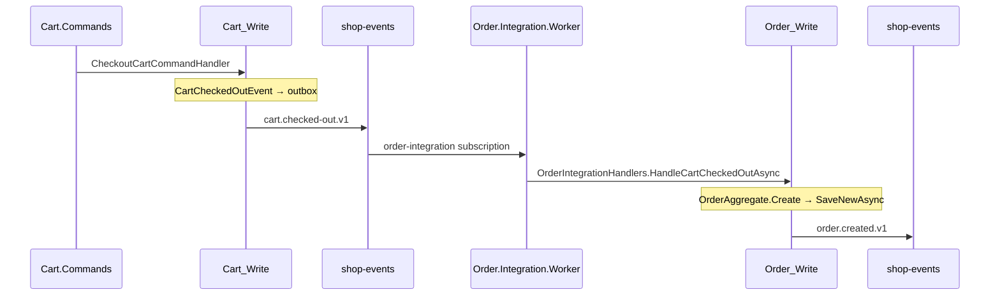
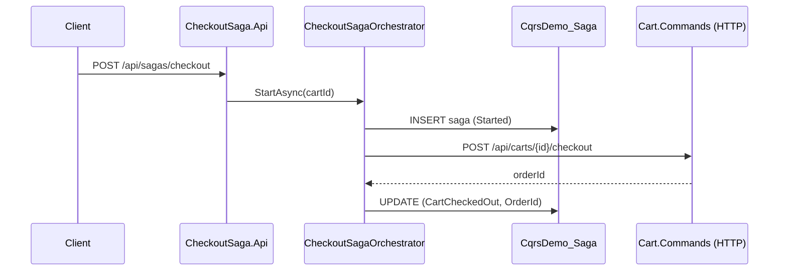
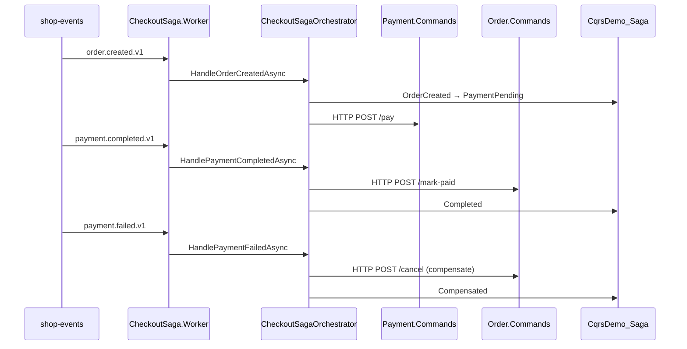
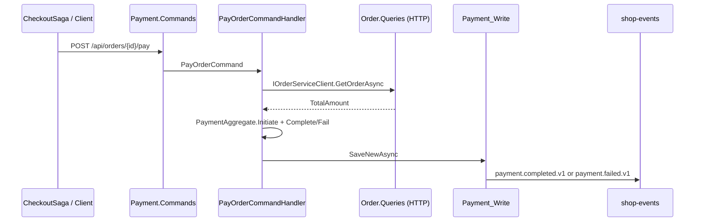

# Code Flows

Step-by-step explanation of how code runs in **CqrsDemo.Distributed.sln** — from HTTP request to database, message bus, and read models.

Related docs: [ARCHITECTURE.md](./ARCHITECTURE.md) · [DATABASE-SCHEMA.md](./DATABASE-SCHEMA.md) · [README-DISTRIBUTED.md](./README-DISTRIBUTED.md).

---

## 1. Project layout (per domain)

Every bounded context follows the same shape:

```text
src/Services/{Domain}/
├── {Domain}.Domain/           Aggregates, domain events, business rules
├── {Domain}.Application/      MediatR commands/queries, handlers
├── {Domain}.Infrastructure/   Event store serializers, mappers, read DB, DI
├── {Domain}.Commands.Api/     HTTP write API (port 520x)
├── {Domain}.Queries.Api/      HTTP read API (port 521x)
└── {Domain}.Projection.Worker Service Bus consumer → update read DB

src/BuildingBlocks/
├── CqrsDemo.BuildingBlocks.Domain       Entity, AggregateRoot, IDomainEvent
├── CqrsDemo.BuildingBlocks.EventStore   SqlEventStore, EventStoreDbContext
└── CqrsDemo.BuildingBlocks.Messaging    Outbox publisher, Service Bus consumer base

src/CqrsDemo.Contracts/        Integration event DTOs + event type constants
src/Services/Saga/             Checkout orchestration (separate from domains)
```

| Layer | Typical types | Role |
|-------|----------------|------|
| **Commands.Api** | `Program.cs`, minimal endpoints | `POST` → `IMediator.Send(command)` |
| **Application** | `*CommandHandler`, `*QueryHandler` | Orchestrate use case |
| **Domain** | `*Aggregate`, `*Event` | Enforce invariants; emit domain events |
| **Infrastructure** | `SqlEventStore`, `*IntegrationEventMapper` | Persistence + outbox mapping |
| **Projection.Worker** | `*ProjectionProcessor` | Consume bus → `*ProjectionHandler` |

---

## 2. Write flow (command → event store → outbox)

Applies to **Product**, **Cart**, **Order**, **Payment** command APIs.

### 2.1 Sequence



### 2.2 Example: create product

| Step | File | What happens |
|------|------|----------------|
| 1 | `Product.Commands.Api/Program.cs` | `POST /api/products` → `mediator.Send(new CreateProductCommand(...))` |
| 2 | `CreateProductCommandHandler.cs` | `ProductAggregate.Create(name, price)` |
| 3 | `ProductAggregate.cs` | `Raise(ProductCreatedEvent)` → `Apply` + `RaiseDomainEvent` |
| 4 | `SqlEventStore.AppendAsync` | Append rows to `StoredEvents`; map events via `ProductIntegrationEventMapper` → `OutboxMessages` |
| 5 | `OutboxPublisherBackgroundService` | Poll outbox → `AzureServiceBusIntegrationEventPublisher` → topic `shop-events` |

**Registration (write side):** `Product.Infrastructure/DependencyInjection.cs` calls:

- `AddEventStoreInfrastructure` → `IEventStore` = `SqlEventStore`
- `AddServiceBusOutbox` → hosted `OutboxPublisherBackgroundService`

### 2.3 Aggregate lifecycle

```text
Create path:
  ProductAggregate.Create(...)
    → private Raise(event): Apply(event) + RaiseDomainEvent(event)
    → eventStore.SaveNewAsync(aggregate, StreamType)   // expectedVersion = 0

Update path:
  eventStore.LoadAsync(id, StreamType, Aggregate.Load)
    → replay StoredEvents in order → Apply each → SetVersion
    → aggregate.SomeMethod() → new domain events
    → eventStore.SaveAsync(aggregate, StreamType)      // optimistic concurrency
```

**Concurrency:** `SqlEventStore` compares `expectedVersion` with `MAX(Version)` on the stream. Mismatch → `ConcurrencyException` → API returns `409 Conflict`.

**Domain events vs integration events:**

| Kind | Where | Purpose |
|------|--------|---------|
| Domain event | `{Domain}.Domain/Events/*` | Inside aggregate; stored in `StoredEvents` |
| Integration event | `CqrsDemo.Contracts/*` | JSON on bus; consumed by other services / projections |

Mapping: `{Domain}IntegrationEventMapper` implements `IIntegrationEventMapper` — runs inside `SqlEventStore` when saving.

---

## 3. Read flow (query → read DB only)

Queries **never** touch the event store or write DB.



| Step | File | What happens |
|------|------|----------------|
| 1 | `Product.Queries.Api/Program.cs` | `GET /api/products` → `GetAllProductsQuery` |
| 2 | `GetAllProductsQueryHandler.cs` | `IProductReadRepository.GetAllAsync()` |
| 3 | `SqlProductReadRepository.cs` | EF Core query on `ProductReadDbContext` |

Read models are **eventually consistent** — updated asynchronously by projection workers (section 4).

---

## 4. Projection flow (bus → read DB)

Each domain has a worker subscribed to **one** Service Bus subscription.



| Step | File | What happens |
|------|------|----------------|
| 1 | `ServiceBusConsumerBackgroundService` | Receive message; read `Subject` / `EventType` + JSON body |
| 2 | `ProductProjectionProcessor` | `switch (eventType)` → `ProductProjectionHandler.HandleAsync` |
| 3 | `ProductProjectionHandler` | Deserialize `ProductCreatedIntegrationEvent` → `UpsertAsync(ProductReadModel)` |
| 4 | On success | `CompleteMessageAsync` |
| 5 | On failure | `AbandonMessageAsync` (retry) |

**Important:** projection handlers deserialize **integration** contracts from `CqrsDemo.Contracts`, not domain event types.

---

## 5. Cross-service integration (cart checkout → order)

Order is **not** created inside Cart. Cart only emits `cart.checked-out.v1`; **Order.Integration.Worker** creates the order aggregate.



| Step | File | What happens |
|------|------|----------------|
| 1 | `CheckoutCartCommandHandler.cs` | Load cart → `cart.Checkout(orderId)` → `SaveAsync` |
| 2 | `CartAggregate.Checkout` | Raises `CartCheckedOutEvent` (includes lines, customerId, orderId) |
| 3 | `CartIntegrationEventMapper` | Maps to `CartCheckedOutIntegrationEvent` in outbox |
| 4 | `OrderIntegrationProcessor.cs` | Receives `cart.checked-out.v1` |
| 5 | `OrderIntegrationHandlers.cs` | If order stream missing → `OrderAggregate.Create(...)` → `SaveNewAsync` |
| 6 | `OrderIntegrationEventMapper` | Publishes `order.created.v1` |

**Idempotency note:** handler returns early if order stream already exists (`LoadAsync` not null).

---

## 6. Checkout saga flow (orchestration)

Saga coordinates **HTTP steps** and reacts to **async events**. State lives in `CqrsDemo_Saga.CheckoutSagas` (not event-sourced).

### 6.1 Start saga (API)



| Step | File | What happens |
|------|------|----------------|
| 1 | `CheckoutSaga.Api/Program.cs` | `StartCheckoutSagaCommand` via MediatR |
| 2 | `StartCheckoutSagaCommandHandler.cs` | Delegates to `CheckoutSagaOrchestrator.StartAsync` |
| 3 | `ShopServiceClients.cs` | `CartCommandClient` HTTP POST checkout |
| 4 | `SqlCheckoutSagaRepository.cs` | Persist saga instance |

### 6.2 Continue saga (worker + HTTP)



| Event | Orchestrator method | HTTP side effect |
|-------|---------------------|----------------|
| `order.created.v1` | `HandleOrderCreatedAsync` | `PaymentCommandClient.PayOrderAsync` |
| `payment.completed.v1` | `HandlePaymentCompletedAsync` | `OrderCommandClient.MarkOrderPaidAsync` |
| `payment.failed.v1` | `HandlePaymentFailedAsync` | `OrderCommandClient.CancelOrderAsync` |

Worker entry: `CheckoutSagaOrchestrationProcessor.cs` → subscription `checkout-saga-orchestration`.

Saga completion notifications: `CheckoutSagaNotifier.cs` → `checkout-saga.completed.v1` / `checkout-saga.failed.v1`.

### 6.3 Saga state (code)

States are string constants in `CqrsDemo.Contracts/Saga/CheckoutSagaStates.cs`:

```text
Started → CartCheckedOut → OrderCreated → PaymentPending → Completed
                              ↓ failure path
                         PaymentFailed → Compensating → Compensated | Failed
```

---

## 7. Payment flow (sync read + async write)

Payment command needs the **order total** from the read side before charging.



| Step | File | What happens |
|------|------|----------------|
| 1 | `PayOrderCommandHandler.cs` | HTTP GET order from `Order.Queries` (configured `OrderService:BaseUrl`) |
| 2 | `PaymentAggregate` | `Initiate` → optional `Complete()` or `Fail()` |
| 3 | Outbox | `payment.completed.v1` or `payment.failed.v1` |
| 4 | Saga worker | Completes or compensates order (section 6) |

Query param `simulateFailure=true` on Payment API → `PayOrderCommand(SimulateFailure: true)` for demo compensation.

---

## 8. Gateway flow

`Shop.Gateway.Api` uses **YARP** — path prefix stripped, request forwarded to backend port.

```text
http://localhost:5000/product-commands/api/products
        → http://localhost:5201/api/products

http://localhost:5000/checkout-saga/api/sagas/checkout
        → http://localhost:5205/api/sagas/checkout
```

Config: `src/Gateway/Shop.Gateway.Api/appsettings.json` (`ReverseProxy:Routes` + `Clusters`).

---

## 9. End-to-end: happy-path checkout (file checklist)

Use this as a trace guide when debugging.

| # | Action | Primary code |
|---|--------|----------------|
| 1 | Start saga | `CheckoutSaga.Api/Program.cs` |
| 2 | HTTP cart checkout | `CheckoutSaga.Infrastructure/Http/ShopServiceClients.cs` → `CheckoutCartCommandHandler.cs` |
| 3 | Outbox `cart.checked-out` | `SqlEventStore.cs` + `CartIntegrationEventMapper` |
| 4 | Create order | `OrderIntegrationHandlers.HandleCartCheckedOutAsync` |
| 5 | Outbox `order.created` | `OrderIntegrationEventMapper` |
| 6 | Saga pays | `CheckoutSagaOrchestrationProcessor` → `TryInitiatePaymentAsync` |
| 7 | Outbox `payment.completed` | `PaymentIntegrationEventMapper` |
| 8 | Mark order paid | `MarkOrderPaidCommandHandler.cs` |
| 9 | Projections update | `*ProjectionHandler` per domain |
| 10 | Query order/cart | `Order.Queries.Api`, `Cart.Queries.Api` |

---

## 10. Shared infrastructure reference

### `SqlEventStore.AppendAsync` (single transaction)

```text
1. Load pending aggregate.DomainEvents
2. Verify stream version (optimistic lock)
3. INSERT each event → StoredEvents (version++)
4. Map domain events → OutboxMessages via IIntegrationEventMapper
5. aggregate.SetVersion + ClearDomainEvents
6. SaveChangesAsync
```

Source: `src/BuildingBlocks/CqrsDemo.BuildingBlocks.EventStore/SqlEventStore.cs`

### `OutboxPublisherBackgroundService`

- Batch size: **20** unprocessed messages
- Poll interval: **2 seconds** when idle
- Marks `ProcessedAt` on success; increments `AttemptCount` on failure

Source: `src/BuildingBlocks/CqrsDemo.BuildingBlocks.Messaging/OutboxPublisherBackgroundService.cs`

### `ServiceBusConsumerBackgroundService`

- `AutoCompleteMessages = false` — manual complete/abandon
- `MaxConcurrentCalls = 1` per subscription processor
- Missing `EventType` → dead-letter

Source: `src/BuildingBlocks/CqrsDemo.BuildingBlocks.Messaging/ServiceBusConsumerBackgroundService.cs`

---

## 11. What each worker listens to

| Worker | Subscription | Handles |
|--------|--------------|---------|
| `Product.Projection.Worker` | `product-projection` | `product.created`, `product.price-updated` |
| `Cart.Projection.Worker` | `cart-projection` | cart lifecycle events |
| `Order.Projection.Worker` | `order-projection` | `order.created`, `order.paid`, `order.cancelled` |
| `Order.Integration.Worker` | `order-integration` | `cart.checked-out` only |
| `Payment.Projection.Worker` | `payment-projection` | payment events |
| `CheckoutSaga.Worker` | `checkout-saga-orchestration` | `order.created`, `payment.completed`, `payment.failed` |

Constants: `CqrsDemo.Contracts/Messaging/ServiceBusSubscriptions.cs` and `IntegrationEventTypes.cs`.

---

## 12. Legacy monolith (`src/CqrsDemo.*`)

Older single-database demo uses **MediatR domain event handlers** (in-process) instead of outbox + Service Bus for some paths. It is **not** part of `CqrsDemo.Distributed.sln` run scripts.

For distributed flows, always trace **`src/Services/*`** and **`src/BuildingBlocks/*`**.

---

*Tip: set breakpoints in `SqlEventStore.AppendAsync`, `OutboxPublisherBackgroundService.PublishBatchAsync`, and your domain `*CommandHandler` to follow one command end-to-end.*
