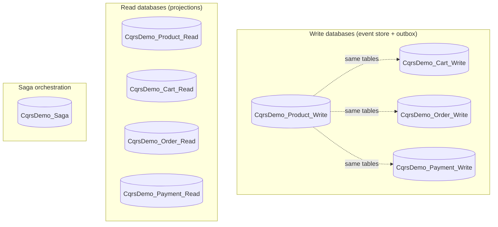
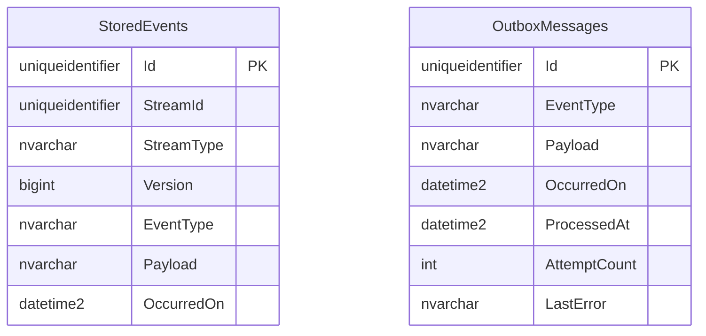
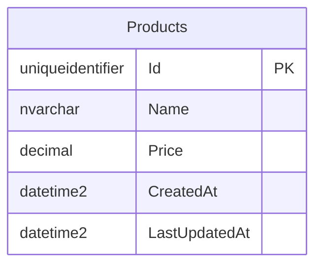
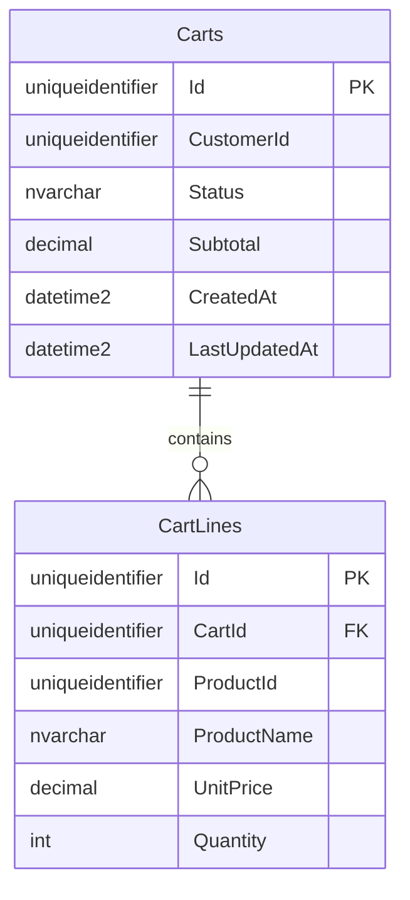
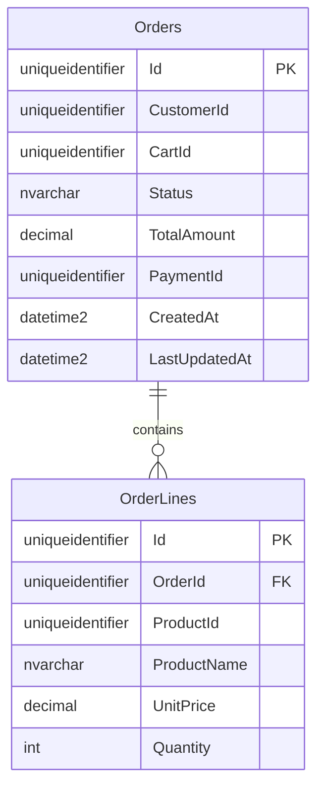
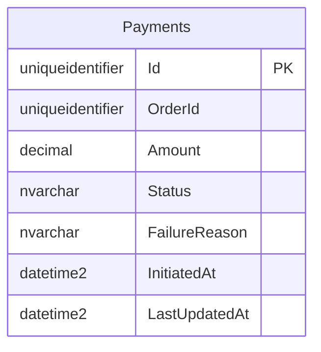
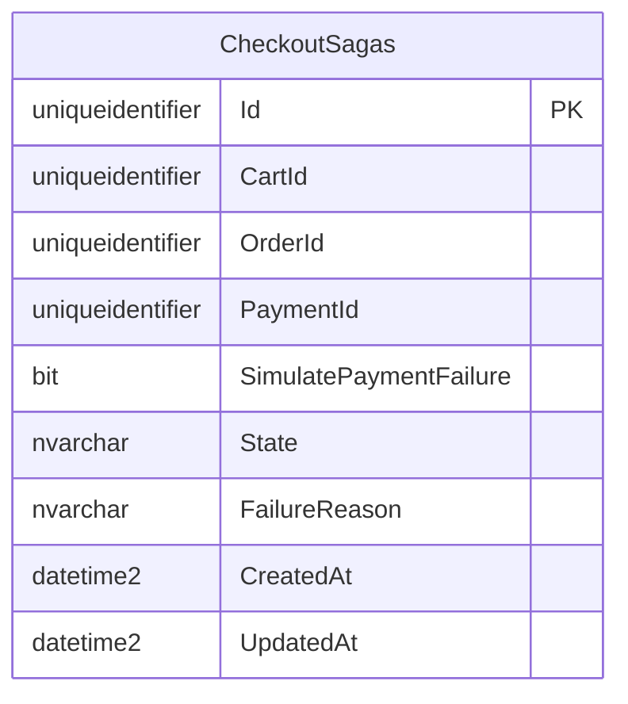
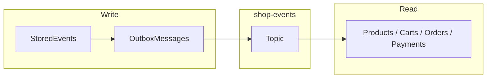

# Database Schema Reference

Physical schema for each microservice database in **CqrsDemo.Distributed.sln**.

Schemas are created via **EF Core `EnsureCreatedAsync()`** (no migrations in this demo). Source of truth for columns and indexes: `*DbContext.OnModelCreating` and entity classes under `src/Services/` and `src/BuildingBlocks/`.

Related: [ARCHITECTURE.md](./ARCHITECTURE.md) · [CODE-FLOWS.md](./CODE-FLOWS.md)

---

## Overview



| Database | Connection key | Used by |
|----------|----------------|---------|
| `CqrsDemo_Product_Write` | `WriteDb` | Product.Commands.Api, outbox publisher |
| `CqrsDemo_Product_Read` | `ReadDb` | Product.Queries.Api, Product.Projection.Worker |
| `CqrsDemo_Cart_Write` | `WriteDb` | Cart.Commands.Api |
| `CqrsDemo_Cart_Read` | `ReadDb` | Cart.Queries.Api, Cart.Projection.Worker |
| `CqrsDemo_Order_Write` | `WriteDb` | Order.Commands.Api, Order.Integration.Worker |
| `CqrsDemo_Order_Read` | `ReadDb` | Order.Queries.Api, Order.Projection.Worker |
| `CqrsDemo_Payment_Write` | `WriteDb` | Payment.Commands.Api |
| `CqrsDemo_Payment_Read` | `ReadDb` | Payment.Queries.Api, Payment.Projection.Worker |
| `CqrsDemo_Saga` | `SagaDb` | CheckoutSaga.Api, CheckoutSaga.Worker |
| `CqrsDemo_User_Write` | `WriteDb` | User.Commands.Api |
| `CqrsDemo_User_Read` | `ReadDb` | User.Queries.Api, User.Projection.Worker |
| `CqrsDemo_Reporting` | `ReportingDb` | Reporting.Queries.Api, Reporting.Projection.Worker |

**Write DBs share the same table design** (Building Blocks `EventStoreDbContext`). **Read DBs** are tailored per domain.

---

## Shared write schema (all command services)

Implemented once in `CqrsDemo.BuildingBlocks.EventStore` and registered per service with `AddEventStoreInfrastructure(configuration, "WriteDb")`.

### ER diagram



### Table: `StoredEvents`

Append-only event log. One **stream** = one aggregate instance (`StreamId` + `StreamType`).

| Column | Type | Constraints | Description |
|--------|------|-------------|-------------|
| `Id` | `uniqueidentifier` | PK | Row id for this event record |
| `StreamId` | `uniqueidentifier` | — | Aggregate id (e.g. product id, cart id) |
| `StreamType` | `nvarchar(100)` | NOT NULL | Aggregate name: `Product`, `Cart`, `Order`, `Payment` |
| `Version` | `bigint` | — | Monotonic version **per stream** (1, 2, 3, …) |
| `EventType` | `nvarchar(200)` | NOT NULL | CLR event name, e.g. `ProductCreatedEvent` |
| `Payload` | `nvarchar(max)` | NOT NULL | JSON serialized domain event |
| `OccurredOn` | `datetime2` | — | When the event occurred |

**Indexes**

| Name | Columns | Unique |
|------|---------|--------|
| PK | `Id` | Yes |
| IX | `(StreamId, StreamType, Version)` | Yes |

**Concurrency:** `SqlEventStore` rejects append if `MAX(Version) != expectedVersion` → optimistic locking per aggregate.

### Table: `OutboxMessages`

Transactional outbox; published to Azure Service Bus by `OutboxPublisherBackgroundService`.

| Column | Type | Constraints | Description |
|--------|------|-------------|-------------|
| `Id` | `uniqueidentifier` | PK | Outbox message id |
| `EventType` | `nvarchar(200)` | NOT NULL | Integration event type, e.g. `product.created.v1` |
| `Payload` | `nvarchar(max)` | NOT NULL | JSON integration event |
| `OccurredOn` | `datetime2` | — | Enqueue time |
| `ProcessedAt` | `datetime2` | NULL | Set when successfully published |
| `AttemptCount` | `int` | — | Failed publish attempts |
| `LastError` | `nvarchar(2000)` | NULL | Last publish error message |

**Indexes**

| Columns | Purpose |
|---------|---------|
| `(ProcessedAt, OccurredOn)` | Poll unprocessed messages efficiently |

---

## Reporting (analytics read model)

Single database **`CqrsDemo_Reporting`** — not event-sourced. Populated by **Reporting.Projection.Worker** from integration events.

### Tables

| Table | Purpose |
|-------|---------|
| `UserProfiles` | Denormalized users (`user.registered`, `user.profile-updated`, `user.deactivated`) |
| `OrderFacts` | One row per order (`order.created`, status updates on `order.paid` / `order.cancelled`) |

Top-users reports query `OrderFacts` (exclude `Cancelled`) with `UserEmail` / `UserDisplayName` on each row — **no HTTP** to User service.

---

## User microservice

### Write: `CqrsDemo_User_Write`

**Stream type:** `User`

| EventType | When emitted |
|-----------|--------------|
| `UserRegisteredEvent` | `UserAggregate.Register` |
| `UserProfileUpdatedEvent` | `UpdateProfile` |
| `UserDeactivatedEvent` | `Deactivate` |

| Outbox EventType |
|------------------|
| `user.registered.v1` |
| `user.profile-updated.v1` |
| `user.deactivated.v1` |

### Read: `CqrsDemo_User_Read`

| Column | Type | Notes |
|--------|------|-------|
| `Id` | `uniqueidentifier` PK | Same as user stream id |
| `Email` | `nvarchar(320)` UNIQUE | Normalized lowercase |
| `DisplayName` | `nvarchar(200)` | |
| `IsActive` | `bit` | |
| `RegisteredAt` | `datetime2` | |
| `LastUpdatedAt` | `datetime2` | |

**Relationship:** `Cart.CustomerId` and `Order.CustomerId` store `Users.Id`.

---

## Product microservice

### Write: `CqrsDemo_Product_Write`

**Stream type:** `Product` (`ProductAggregate.StreamType`)

#### Domain events in `StoredEvents.Payload`

| EventType (stored) | When emitted | JSON fields (summary) |
|--------------------|--------------|------------------------|
| `ProductCreatedEvent` | `ProductAggregate.Create` | `ProductId`, `Name`, `Price`, `CreatedAt` |
| `ProductPriceUpdatedEvent` | `UpdatePrice` | `ProductId`, `OldPrice`, `NewPrice`, `UpdatedAt` |

#### Outbox integration events

| EventType | Source domain event |
|-----------|---------------------|
| `product.created.v1` | `ProductCreatedEvent` |
| `product.price-updated.v1` | `ProductPriceUpdatedEvent` |

---

### Read: `CqrsDemo_Product_Read`



| Column | Type | Constraints | Description |
|--------|------|-------------|-------------|
| `Id` | `uniqueidentifier` | PK | Product id |
| `Name` | `nvarchar(200)` | NOT NULL | Display name |
| `Price` | `decimal(18,2)` | — | Current price |
| `CreatedAt` | `datetime2` | — | From first projection |
| `LastUpdatedAt` | `datetime2` | — | Last integration event applied |

**Source:** `Product.Infrastructure/Persistence/Read/ProductReadDbContext.cs`

**Filled by:** `Product.Projection.Worker` ← `product.created.v1`, `product.price-updated.v1`

---

## Cart microservice

### Write: `CqrsDemo_Cart_Write`

**Stream type:** `Cart`

#### Domain events in `StoredEvents.Payload`

| EventType | When emitted |
|-----------|--------------|
| `CartCreatedEvent` | `CartAggregate.Create` |
| `CartItemAddedEvent` | `AddItem` |
| `CartItemRemovedEvent` | `RemoveItem` |
| `CartCheckedOutEvent` | `Checkout` — includes `OrderId`, `CustomerId`, `Lines[]`, `TotalAmount` |

#### Outbox integration events

| EventType | Notes |
|-----------|--------|
| `cart.created.v1` | |
| `cart.item-added.v1` | |
| `cart.item-removed.v1` | |
| `cart.checked-out.v1` | Consumed by **Order.Integration** to create order |

---

### Read: `CqrsDemo_Cart_Read`



#### Table: `Carts`

| Column | Type | Constraints | Description |
|--------|------|-------------|-------------|
| `Id` | `uniqueidentifier` | PK | Cart id |
| `CustomerId` | `uniqueidentifier` | — | Owner |
| `Status` | `nvarchar(50)` | NOT NULL | e.g. `Active`, `CheckedOut` |
| `Subtotal` | `decimal(18,2)` | — | Sum of line totals |
| `CreatedAt` | `datetime2` | — | |
| `LastUpdatedAt` | `datetime2` | — | |

#### Table: `CartLines`

| Column | Type | Constraints | Description |
|--------|------|-------------|-------------|
| `Id` | `uniqueidentifier` | PK | Line row id (projection-generated) |
| `CartId` | `uniqueidentifier` | FK → `Carts.Id` CASCADE | |
| `ProductId` | `uniqueidentifier` | — | |
| `ProductName` | `nvarchar(200)` | NOT NULL | Snapshot at add time |
| `UnitPrice` | `decimal(18,2)` | — | |
| `Quantity` | `int` | — | |

**Indexes:** unique `(CartId, ProductId)` on `CartLines`

**Source:** `Cart.Infrastructure/Persistence/Read/CartReadDbContext.cs`

---

## Order microservice

### Write: `CqrsDemo_Order_Write`

**Stream type:** `Order`

#### Domain events in `StoredEvents.Payload`

| EventType | When emitted |
|-----------|--------------|
| `OrderCreatedEvent` | `OrderAggregate.Create` or integration handler |
| `OrderPaidEvent` | `MarkAsPaid` (saga → Order.Commands) |
| `OrderCancelledEvent` | `Cancel` (saga compensation) |

`OrderCreatedEvent` payload includes `OrderId`, `CustomerId`, `CartId`, `Lines[]`, `TotalAmount`, `CreatedAt`.

#### Outbox integration events

| EventType | Consumer highlights |
|-----------|---------------------|
| `order.created.v1` | order-projection, **checkout-saga-orchestration** |
| `order.paid.v1` | order-projection |
| `order.cancelled.v1` | order-projection |

---

### Read: `CqrsDemo_Order_Read`



#### Table: `Orders`

| Column | Type | Constraints | Description |
|--------|------|-------------|-------------|
| `Id` | `uniqueidentifier` | PK | Order id (= stream id / checkout order id) |
| `CustomerId` | `uniqueidentifier` | — | |
| `CartId` | `uniqueidentifier` | — | Originating cart |
| `Status` | `nvarchar(50)` | NOT NULL | `PendingPayment`, `Paid`, `Cancelled` |
| `TotalAmount` | `decimal(18,2)` | — | |
| `PaymentId` | `uniqueidentifier` | NULL | Set when paid |
| `CreatedAt` | `datetime2` | — | |
| `LastUpdatedAt` | `datetime2` | — | |

#### Table: `OrderLines`

| Column | Type | Constraints | Description |
|--------|------|-------------|-------------|
| `Id` | `uniqueidentifier` | PK | |
| `OrderId` | `uniqueidentifier` | FK → `Orders.Id` CASCADE | |
| `ProductId` | `uniqueidentifier` | — | |
| `ProductName` | `nvarchar(200)` | NOT NULL | |
| `UnitPrice` | `decimal(18,2)` | — | |
| `Quantity` | `int` | — | |

**Source:** `Order.Infrastructure/Persistence/Read/OrderReadDbContext.cs`

**Also used by:** Payment.Commands via HTTP `Order.Queries` (reads `TotalAmount` from this DB).

---

## Payment microservice

### Write: `CqrsDemo_Payment_Write`

**Stream type:** `Payment`

#### Domain events in `StoredEvents.Payload`

| EventType | When emitted |
|-----------|--------------|
| `PaymentInitiatedEvent` | `PaymentAggregate.Initiate` |
| `PaymentCompletedEvent` | `Complete` |
| `PaymentFailedEvent` | `Fail` |

Each payment is a **new stream** (`SaveNewAsync`); `StreamId` = payment id.

#### Outbox integration events

| EventType | Consumer highlights |
|-----------|---------------------|
| `payment.initiated.v1` | payment-projection |
| `payment.completed.v1` | payment-projection, **checkout-saga-orchestration** |
| `payment.failed.v1` | payment-projection, **checkout-saga-orchestration** |

---

### Read: `CqrsDemo_Payment_Read`



| Column | Type | Constraints | Description |
|--------|------|-------------|-------------|
| `Id` | `uniqueidentifier` | PK | Payment id |
| `OrderId` | `uniqueidentifier` | indexed | Related order |
| `Amount` | `decimal(18,2)` | — | Charged amount |
| `Status` | `nvarchar(50)` | NOT NULL | `Pending`, `Completed`, `Failed` |
| `FailureReason` | `nvarchar(500)` | NULL | When failed |
| `InitiatedAt` | `datetime2` | — | |
| `LastUpdatedAt` | `datetime2` | — | |

**Indexes:** `OrderId`

**Source:** `Payment.Infrastructure/Persistence/Read/PaymentReadDbContext.cs`

---

## Checkout Saga (orchestration store)

Not event-sourced. Plain relational state for the saga process manager.

### Database: `CqrsDemo_Saga`



#### Table: `CheckoutSagas`

| Column | Type | Constraints | Description |
|--------|------|-------------|-------------|
| `Id` | `uniqueidentifier` | PK | Saga instance id |
| `CartId` | `uniqueidentifier` | indexed | Checkout target |
| `OrderId` | `uniqueidentifier` | NULL, indexed | Set after cart checkout |
| `PaymentId` | `uniqueidentifier` | NULL | Set after payment command |
| `SimulatePaymentFailure` | `bit` | — | Demo flag for compensation |
| `State` | `nvarchar(64)` | NOT NULL | See state values below |
| `FailureReason` | `nvarchar(2000)` | NULL | Error / compensation reason |
| `CreatedAt` | `datetime2` | — | |
| `UpdatedAt` | `datetime2` | — | |

**State values** (`CheckoutSagaStates`): `Started`, `CartCheckedOut`, `OrderCreated`, `PaymentPending`, `Completed`, `PaymentFailed`, `Compensating`, `Compensated`, `Failed`

**Source:** `CheckoutSaga.Infrastructure/Persistence/CheckoutSagaDbContext.cs`

---

## Stream inventory (write DB)

Logical aggregates stored in `StoredEvents` (filtered by `StreamType`).

| Service | StreamType | StreamId | Typical event count per operation |
|---------|------------|----------|-----------------------------------|
| Product | `Product` | Product id | 1 per command |
| Cart | `Cart` | Cart id | 1 per command |
| Order | `Order` | Order id | 1+ over lifetime |
| Payment | `Payment` | Payment id | 1–2 per payment (initiate + complete/fail) |

**Example stream (Product id `a1b2…`):**

```text
Version  EventType                 Payload (JSON, abbreviated)
-------  ------------------------  ---------------------------
1        ProductCreatedEvent       { "productId": "...", "name": "Phone", ... }
2        ProductPriceUpdatedEvent  { "productId": "...", "newPrice": 499, ... }
```

Rebuild aggregate in code: `ProductAggregate.Load(events)` replays rows in version order.

---

## Read vs write: what queries see



| Concern | Write DB | Read DB |
|---------|----------|---------|
| Purpose | Source of truth for commands | Optimized queries |
| Shape | Event log + outbox | Denormalized tables |
| Updated by | Command handlers | Projection workers only |
| Consistency | Immediate after command | Eventual (bus + worker lag) |

---

## Entity Framework source files

| Database | DbContext / entities |
|----------|----------------------|
| All `*_Write` | `BuildingBlocks/.../EventStoreDbContext.cs`, `StoredEventEntity`, `OutboxMessageEntity` |
| `Product_Read` | `Product.Infrastructure/.../ProductReadDbContext.cs` |
| `Cart_Read` | `Cart.Infrastructure/.../CartReadDbContext.cs` |
| `Order_Read` | `Order.Infrastructure/.../OrderReadDbContext.cs` |
| `Payment_Read` | `Payment.Infrastructure/.../PaymentReadDbContext.cs` |
| `Saga` | `CheckoutSaga.Infrastructure/.../CheckoutSagaDbContext.cs` |

---

## Inspecting data locally

```sql
-- Write: list streams for a cart
SELECT StreamId, Version, EventType, OccurredOn
FROM StoredEvents
WHERE StreamType = 'Cart'
ORDER BY StreamId, Version;

-- Write: pending outbox
SELECT EventType, OccurredOn, AttemptCount, LastError
FROM OutboxMessages
WHERE ProcessedAt IS NULL;

-- Read: orders awaiting payment
SELECT Id, Status, TotalAmount FROM Orders WHERE Status = 'PendingPayment';

-- Saga: in-flight checkouts
SELECT Id, CartId, OrderId, State, UpdatedAt FROM CheckoutSagas
WHERE State NOT IN ('Completed', 'Compensated', 'Failed');
```

Adjust database name per service (`CqrsDemo_Order_Read`, etc.).

---

## Legacy monolith databases

`src/CqrsDemo.*` may use `CqrsDemo_Write` / `CqrsDemo_Read` with a different layout (non–event-store product tables). **This document applies only to the distributed solution under `src/Services/`.**
